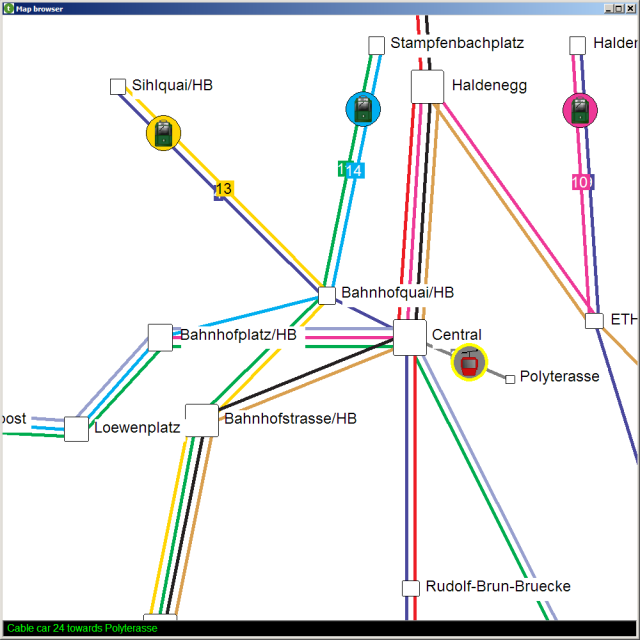

# Overview 

Traffic 4 source code consists of two top-level directories:
* **library**: contains the Traffic library (the core of Traffic);
* **examples**: contains some examples of how the library can be used, along with resource files (images and maps). 

## Library

The purpose of the Traffic 4 library is to model and visualize the public transportation system of a city.

### Model 

One part of the library is responsible for *modeling* the city, regardless of any particular graphical (or textual) representation.
The classes of this part represent objects in the city, such as public transportation stations, lines and vehicles (trams, buses, cable cars);
they allow you to construct the city and query properties of its objects: their name, location or speed.
If you don't want your application to visualize the city,
but only to compute some interesting properties
(e.g. the shortest path from one station to another),
you can just use these *model* classes,
located in the **city** directory.

### View

Another part of the library is responsible for *visualizing* the city.
Each class from this part (located in the **view** directory) represents a view of some city object
and knows how to display this object on the map.
In the library we implemented one particular way of displaying city objects,
but in principle a single model of a city can have several views
(e.g. a 2D, a 3D and a pseudo-graphics representation).

In a typical Traffic 4 application you would work with a model of a city:
	city: CITY
and its graphical representation, the map:
	map: MAP

You would modify the public transportation of the city, e.g. add a station to line 15:
	city.add_station ("Bucheggplatz")
	city.connect_station (15, "Bucheggplatz")
and then you would want to synchronize the view with the model, so that the new station appears on the map:
	map.update

Sometimes you don't want to modify the city, but only change the way some objects are displayed,
e.g. you want to highlight a station.
Then you would operate directly on the map:
	map.station_views ["Bucheggplatz"].highlight

### Store 

Another part of the library (located in the **store** directory) is responsible for loading a city model from a file and saving it to a file.
At the moment a single XML-based file format is supported.

## Examples 

### Map Browser 

*Map Browser* is a graphical application that allows you to browse a city map.
It loads a city description from an xml file and displays its map on the screen.
A user can:
* move the map by dragging it;
* zoom the map using the mouse wheel;
* select map objects by left-clicking on them: information about the object is displayed in the console;
* start and stop animation by double-clicking on the map.

### Resource files 

The **map** directory contains a *dtd* definition of the file format used by Traffic 4 along with an example map of Zurich.

The **image** directory contains icons used by the Traffic 4 example applications.

